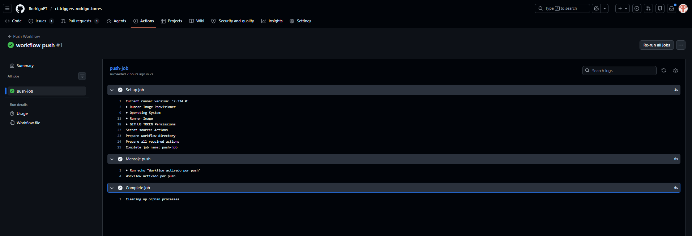
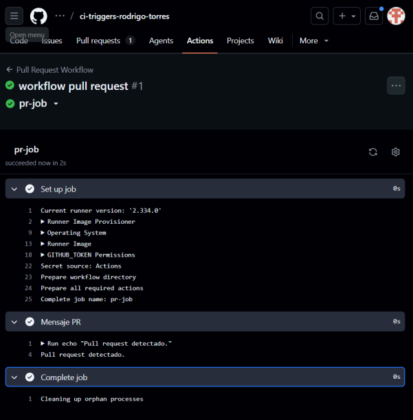
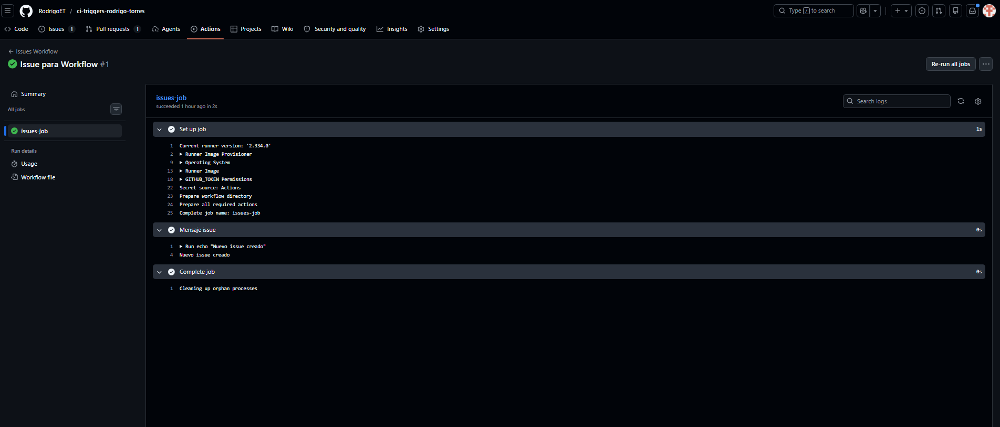
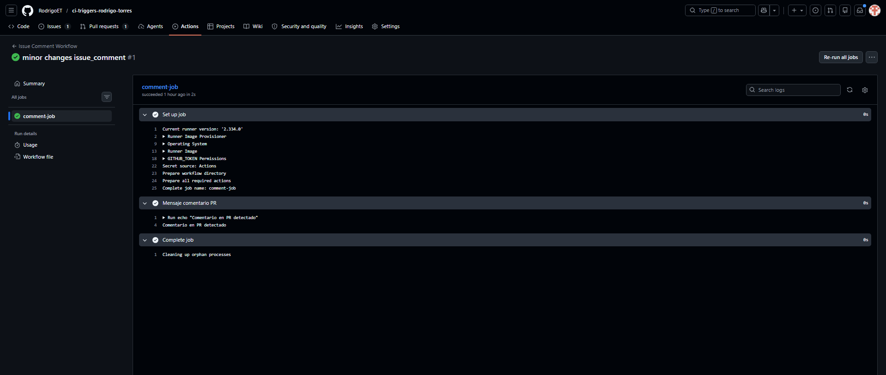
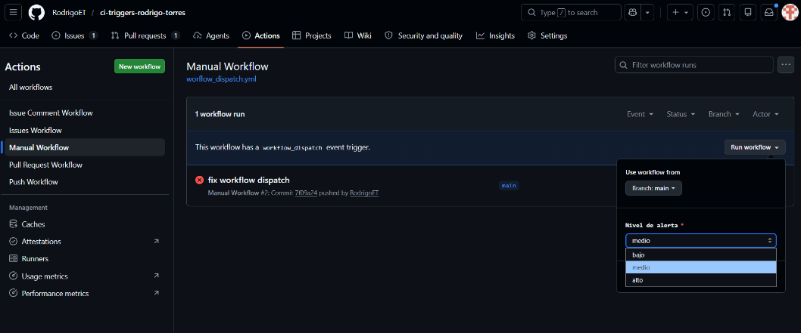
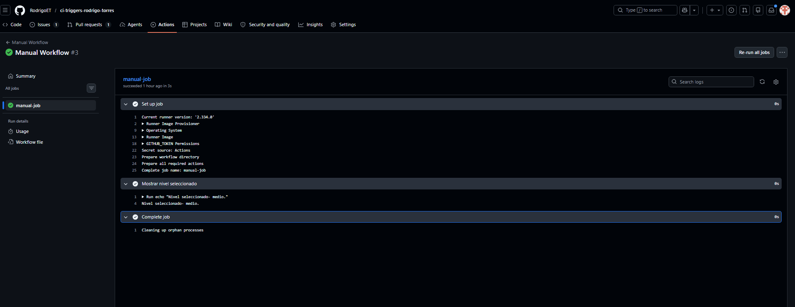
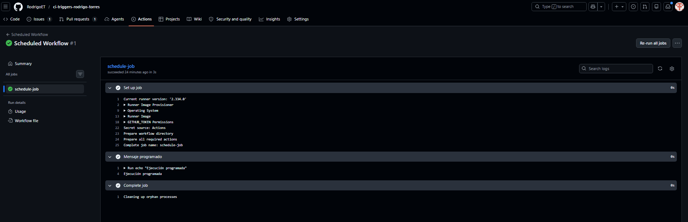

# ci-triggers-rodrigo-torres

📌 Proyecto: Workflows GitHub Actions
👤 Nombre

Rodrigo Torres

⚙️ Workflows implementados
1. Push
Se ejecuta al hacer push a main
✔ Imprime: "Workflow activado por push"

2. Pull Request
Se ejecuta al abrir PR
✔ Imprime: "Pull request detectado"

3. Issues
Se ejecuta al crear issue
✔ Imprime: "Nuevo issue creado"

4. Issue Comment
Se ejecuta al comentar en PR
✔ Filtrado para PR
✔ Imprime: "Comentario en PR detectado"

5. Manual (workflow_dispatch)
Se ejecuta manualmente
✔ Input: nivel (bajo/medio/alto)
✔ Imprime valor seleccionado

6. Schedule
Se ejecuta automáticamente cada 5 minutos
✔ Imprime: "Ejecución programada"
